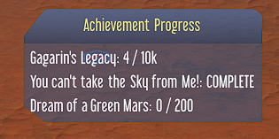

## Achievement Tracker
 - Track achievement progress on screen 
 - Track primary achievement in dedicated window

### On Screen Display (OSD):

### Progress Message:

### Description:
Tracks achievements as you make progress towards them. To toggle tracking of achievement on/off, select it in the list of 'TrackedAchievements' in the mod options and apply.

- OSD can be moved by dragging around the title
- OSD can be closed by double-clicking on it
- Simply re-apply mod options (with display type set  correctly) to re-open it

### Options:
    Show Failure Messages
        On / Off
    
    Display Mode: Select how to display updates on achievements in progress
        Messages
        OSD (On Screen Display)
        Both

    Primary Achievement: Select which achievement shows in Primary Achievement Window
        [All The Achievements]

    Message Length: Time Displayed on Screen
        1 - 60 seconds

    Message Delay (Sols): Delay between messages in sols
        0 - 7 sols

    Message Delay (Hours): Delay between messages in hours (combines with sols)
        0 - 25 hours

### Special Thanks:
Thanks to *ChoGGi* for all of his assistance, ECM, and countless mods providing good example code for me to learn.

Thanks to *LoneSamurai* for the mod idea, testing, and suggestions.

Thanks to *Ella* for testing, feedback, and suggestions. 

## Notes:
If you have any feedback please contact me directly instead of reporting the mod. I'm always happy to take requests as well. 
I hang out in [*Discord*](https://discord.gg/kTgYq9UjWx) and on [*Reddit*](https://www.reddit.com/user/Fizzle_Fuze)

Please take a second to rate this mod and leave a comment. 
Your feedback helps me produce better quality mods!

Have a good game, 
Fizzle Fuze :)

## Info:

### Changelog:
Details on the latest changes as well as changes in future versions are found in [*Info/changelog.md*](Info/changelog.md)

### Contact Me:
I appreciate feedback on my mods and ideas for new ones!
 - Discord:https://discord.gg/kTgYq9UjWx
 - Reddit: /u/Fizzle_Fuze (/r/SurvivingMars)
 - Email: mods@fizzlefuze.com

See [*Info/ContactMe.txt*](Info/ContactMe.txt) for more info on contacting me.

### Other Locations:
My mods are also available on Steam and the Paradox Website:

[Steam Workshop](https://steamcommunity.com/id/fizzle_fuze/myworkshopfiles/?appid=464920)  
[Paradox Plaza](https://mods.paradoxplaza.com/games/surviving_mars?search=Fizzle_Fuze&sortBy=best)

### License:
See [*Info/License.md*](Info/license.md) and [*Info/LICENSE*](Info/LICENSE) for copyright and licensing info.
